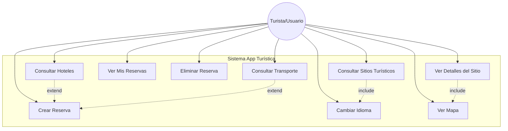
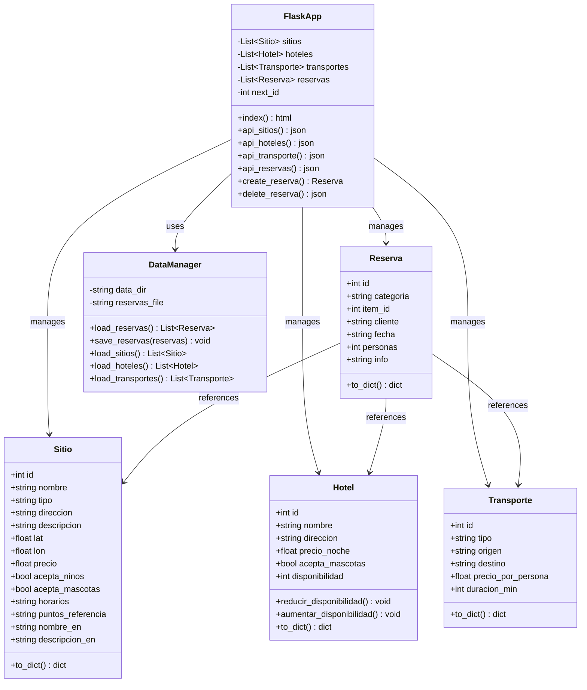
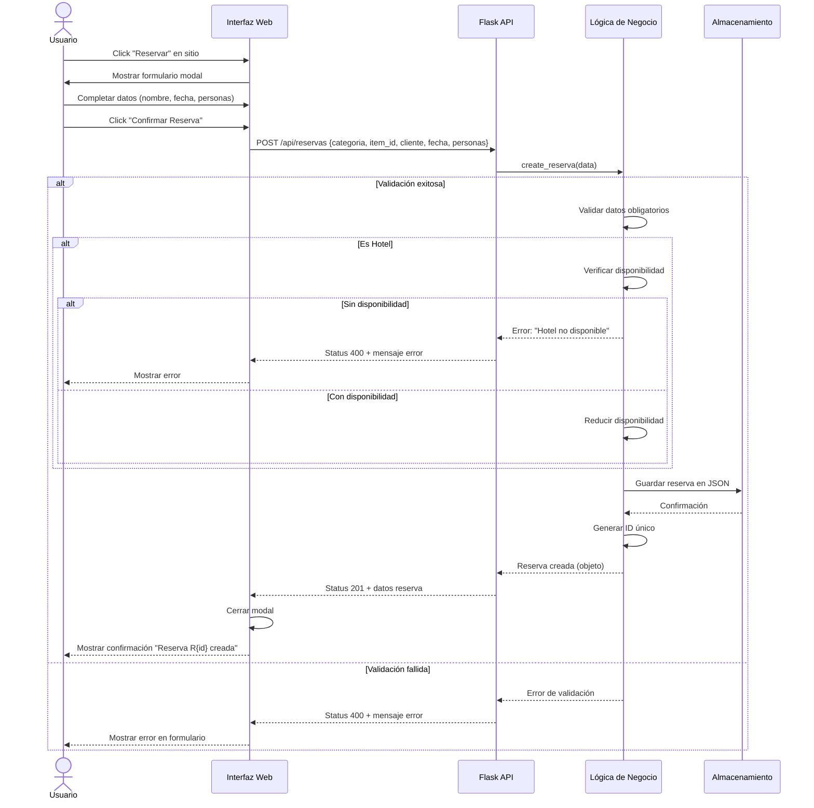
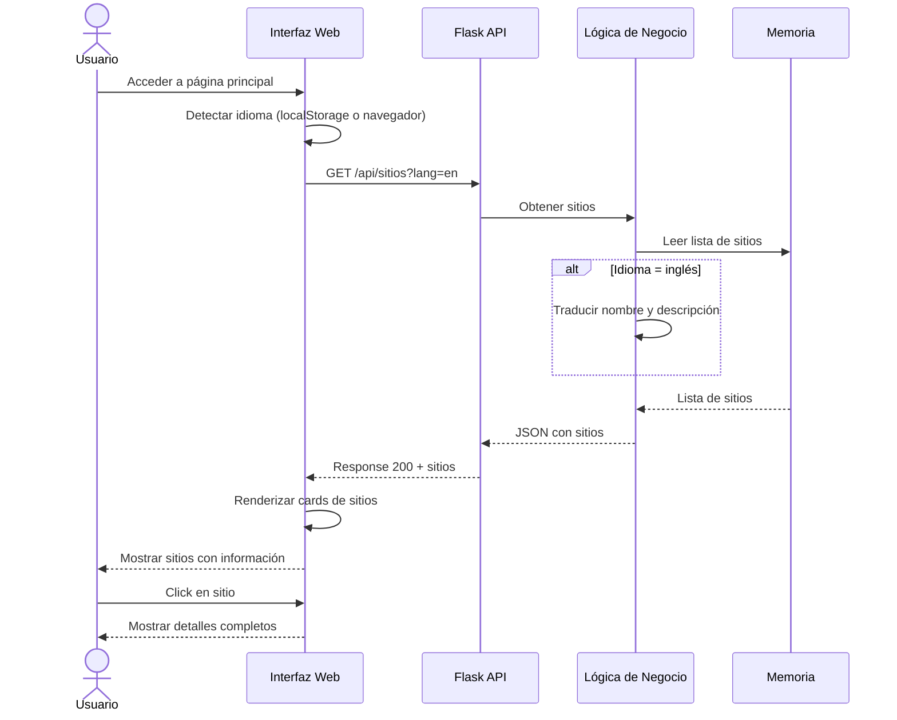
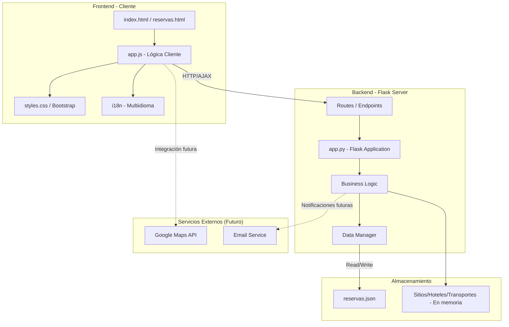
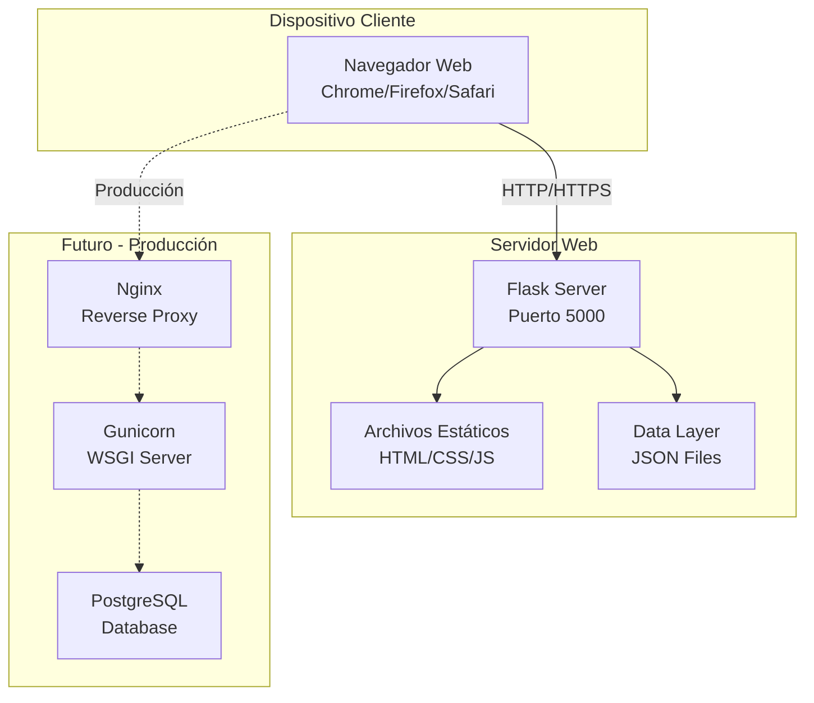
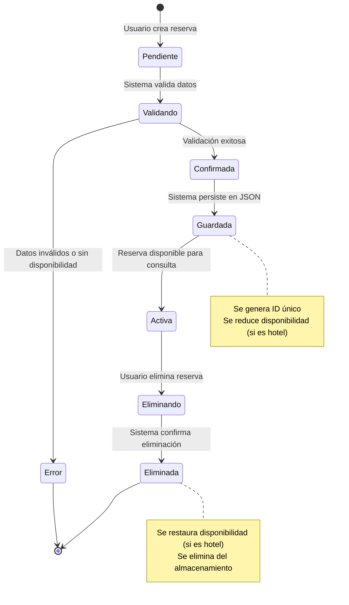
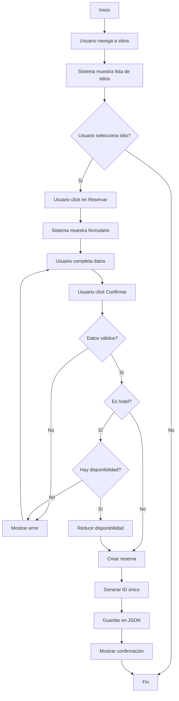
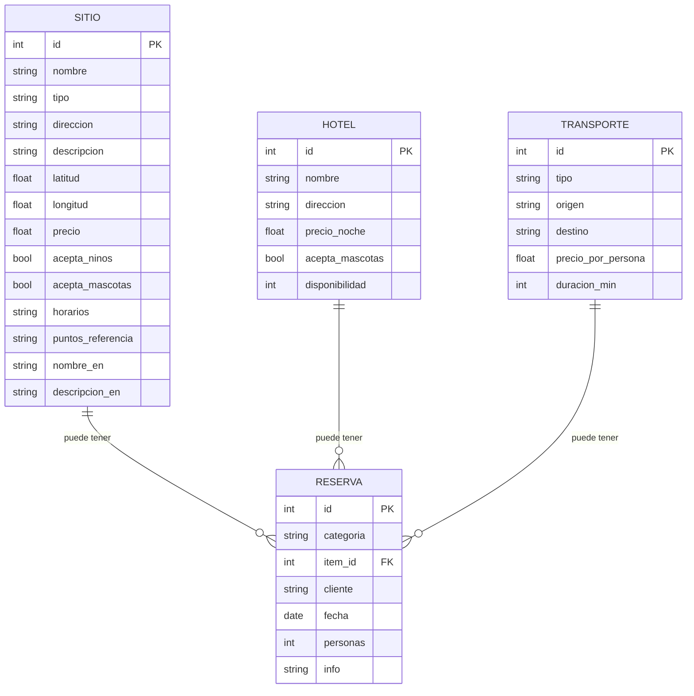

# Diagramas UML - App Turística Colombia

**Proyecto:** Sistema de Información Turística para Extranjeros en Colombia
**Curso:** Teoría de Sistemas - CUC

---

## 1. Diagrama de Casos de Uso



---

## 2. Diagrama de Clases



---

## 3. Diagrama de Secuencia: Crear Reserva



---

## 4. Diagrama de Secuencia: Consultar Sitios



---

## 5. Diagrama de Componentes



---

## 6. Diagrama de Despliegue



---

## 7. Diagrama de Estados: Reserva



---

## 8. Diagrama de Actividades: Flujo de Reserva



---

## 9. Diagrama Entidad-Relación (ER)



---

## 10. Diagrama de Arquitectura del Sistema

```
┌─────────────────────────────────────────────────────────────┐
│                     CAPA DE PRESENTACIÓN                     │
│  ┌──────────────┐  ┌──────────────┐  ┌──────────────┐       │
│  │  index.html  │  │reservas.html │  │  styles.css  │       │
│  └──────────────┘  └──────────────┘  └──────────────┘       │
│  ┌──────────────────────────────────────────────────┐       │
│  │            app.js (JavaScript)                    │       │
│  │  - Fetch API calls                                │       │
│  │  - DOM manipulation                               │       │
│  │  - Event handlers                                 │       │
│  │  - i18n logic                                     │       │
│  └──────────────────────────────────────────────────┘       │
└─────────────────────────────────────────────────────────────┘
                            │
                   HTTP (REST API)
                            ▼
┌─────────────────────────────────────────────────────────────┐
│                    CAPA DE APLICACIÓN                        │
│  ┌────────────────────────────────────────────────────────┐ │
│  │              Flask Application (app.py)                 │ │
│  │                                                          │ │
│  │  RUTAS / ENDPOINTS                                      │ │
│  │  • GET  /                  → index.html                 │ │
│  │  • GET  /reservas          → reservas.html              │ │
│  │  • GET  /api/sitios        → Lista sitios               │ │
│  │  • GET  /api/hoteles       → Lista hoteles              │ │
│  │  • GET  /api/transporte    → Lista transporte           │ │
│  │  • GET  /api/reservas      → Lista reservas             │ │
│  │  • POST /api/reservas      → Crear reserva              │ │
│  │  • DELETE /api/reservas/:id → Eliminar reserva          │ │
│  │                                                          │ │
│  └────────────────────────────────────────────────────────┘ │
│                            │                                 │
│  ┌────────────────────────────────────────────────────────┐ │
│  │           LÓGICA DE NEGOCIO                             │ │
│  │  • create_reserva()                                     │ │
│  │  • validate_reserva()                                   │ │
│  │  • check_availability()                                 │ │
│  │  • update_disponibilidad()                              │ │
│  └────────────────────────────────────────────────────────┘ │
└─────────────────────────────────────────────────────────────┘
                            │
                            ▼
┌─────────────────────────────────────────────────────────────┐
│                   CAPA DE PERSISTENCIA                       │
│  ┌────────────────────────────────────────────────────────┐ │
│  │            Data Manager                                 │ │
│  │  • _load_reservas_from_disk()                          │ │
│  │  • _save_reservas_to_disk()                            │ │
│  │  • Threading lock para concurrencia                    │ │
│  └────────────────────────────────────────────────────────┘ │
│                            │                                 │
│  ┌────────────────────────────────────────────────────────┐ │
│  │         ALMACENAMIENTO                                  │ │
│  │  • data/reservas.json (persistente)                    │ │
│  │  • SITIOS[] (en memoria)                               │ │
│  │  • HOTELES[] (en memoria)                              │ │
│  │  • TRANSPORTES[] (en memoria)                          │ │
│  └────────────────────────────────────────────────────────┘ │
└─────────────────────────────────────────────────────────────┘
```

---

## 11. Patrones de Diseño Utilizados

### 11.1 MVC (Model-View-Controller)
- **Model:** Clases Sitio, Hotel, Transporte, Reserva
- **View:** Archivos HTML + CSS (templates)
- **Controller:** Flask routes y business logic

### 11.2 Repository Pattern
- **DataManager:** Abstracción para manejo de persistencia
- Separa lógica de negocio del almacenamiento

### 11.3 Singleton Pattern
- **FlaskApp:** Una sola instancia de la aplicación
- **DataManager:** Manejo centralizado de datos

### 11.4 RESTful API
- Uso de HTTP methods apropiados (GET, POST, DELETE)
- Recursos bien definidos (/api/sitios, /api/reservas)
- Respuestas JSON estándar

---

## 12. Flujo de Datos

```
Usuario → Navegador → HTTP Request → Flask Routes
                                          ↓
                                    Validación
                                          ↓
                                  Lógica de Negocio
                                          ↓
                                    Data Manager
                                          ↓
                                  Almacenamiento (JSON)
                                          ↓
                          Respuesta ← JSON Response ← Flask
                                          ↓
                                  Renderizado en UI
                                          ↓
                                      Usuario
```

---

**Documento creado:** Noviembre 2025
**Versión:** 1.0

**Notas:**
- Los diagramas están en formato Mermaid para fácil visualización en GitHub
- Para ver los diagramas, usa un visor compatible con Mermaid
- Alternativamente, puedes copiar el código en https://mermaid.live/
